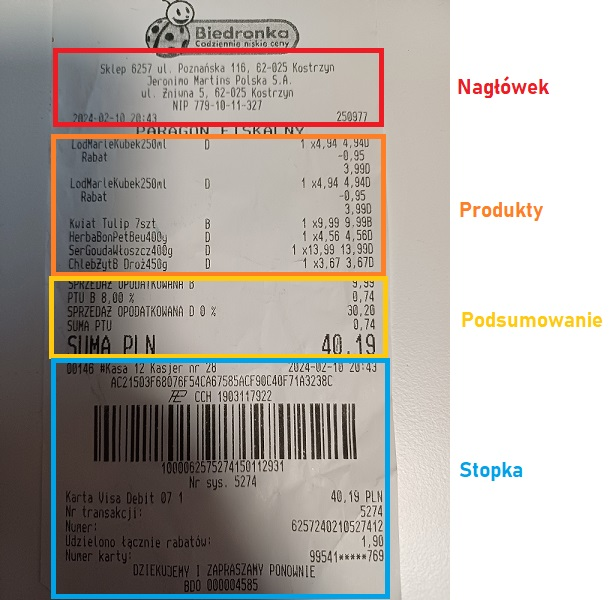
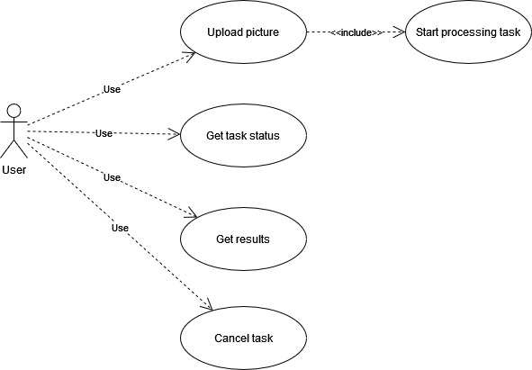
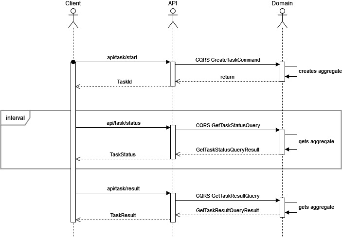
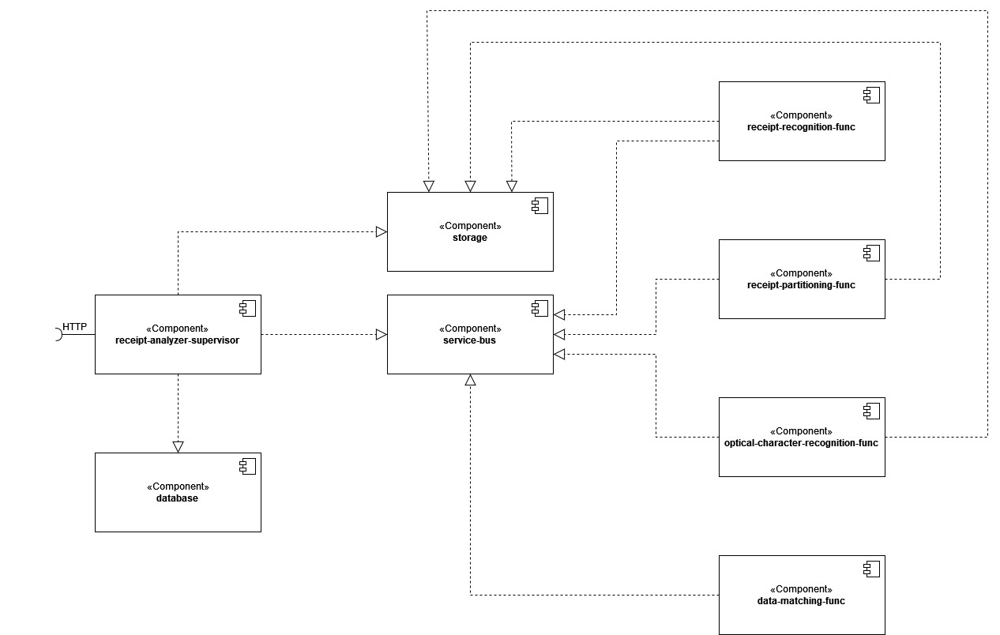

# 100commitów
Projekt jest realizowany w ramach wydarzenia [100commitów](https://100commitow.pl/) (edycja 2024).
Niestety wygląda na to, że nie uda się w terminie projektu skończyć, dlatego napiszę może nieco o przyczynach.

### Co się udało?
1. Zaprojektowanie aplikacji.
2. Utworzenie infrastruktury w Azure.
3. Implementacja komunikacji pomiędzy komponentami (WebAPI z Azure Functions przez Service Bus).
4. Model domenowy.
5. Przygotowanie zestawu danych uczących do etapu 1 (rozpoznawanie paragonów na obrazie).
6. Wytrenowanie modelu do etapu 1 - i w sumie całkiem nieźle ten model sobie radził.
7. Przetestowanie narzędzi OCR - Tesseract i Azure AI Services.
8. Robić 1 commit dziennie.

### Co się nie udało (i dlaczego)?
1. Dokończyć projekt - z przyczyn rodzinno-osobistych zabrakło czasu, widać po commitach z przełomu marzec/kwiecień.
2. Przygotować dobrego zestawu danych uczących do etapu 2 (rozpoznawanie elementów paragonu) - wytrenowany model bardzo słabo rozpoznawał elementy paragonów, popełniał masę błędów i był bardzo nieprecyzyjny. Wynikało to przede wszystkim z braku fachowej wiedzy o sieciach neuronowych i uczeniu ich. Szlak został przetarty i każdny następny model będzie lepszy :)

### Wnioski
1. Więcej czasu przeznaczyć na analizę problemu oraz dostępne narzędzia (zwłaszcza, gdy się z nich wcześniej nie korzystało) przed przystąpieniem do implementacji.
2. W planowaniu projektów uwzględnić pewną "bezwładność" dla sytuacji losowych, które mogą opóźnić realizację.
3. Warto uczyć się Machine Learning :)

# Czym jest ReceiptAnalyzer?

ReceiptAnalyzer to aplikacja umożliwiająca analizę polskiego paragonu fiskalnego na podstawie jego zdjęcia lub skanu. Dane pozyskane w wyniku analizy mogą posłużyć do innych procesów realizowanych po stronie klienta (analiza wydatków, zgodność nagłówka/stopki ze standardami, wykrywanie nieprawidłowości, zbieranie danych statystycznych).

## Zakres pozyskanych danych

+ Nagłówek paragonu:
	* nazwa sprzedawcy
	* adres sprzedawcy
	* NIP sprzedawcy
+ Produkty: 
	* nazwa produktu
	* ilość
	* cena jednostkowa
	* cena całkowita
	* stawka VAT
	* udzielony rabat
	* inne (np. czy lek na receptę)
+ Podsumowanie: 
	* kwota całkowita
	* kwota udzielonych rabatów
	* kwoty poszczególnych stawek VAT
	* suma podatku VAT w poszczególnych stawkach
+ Stopka: 
	* data i godzina transakcji
	* forma płatności
	* użycie karty lojalnościowej
	* numer paragonu w raporcie dobowym
	* numer unikatowy drukarki fiskalnej

## Cele badawcze
+ Azure Functions
+ Azure Service Bus
+ Azure Storage Account
+ Microservice architecture
+ Wstęp do Machine Learning (ML.NET)

## Tech stack
+ .NET 8 (ASP.NET, Entity Framework Core)
+ SQL Server
+ Azure Service Bus

## Roadmapa
1. Projekt
2. Model domeny
3. Model danych
4. WebAPI
5. Rozpoznawanie paragonów (zbiory danych, trenowanie modelu, testowanie modelu)
6. Rozpoznawanie elementów paragonu (zbiory danych, trenowanie modelu, testowanie modelu)
7. Konwersja obrazu na tekst 
8. Mapowanie danych
9. Wdrożenie

# Jak to działa?
### [Warsztat event storming](https://miro.com/app/board/uXjVNlpnhk4=/?share_link_id=300171823287)

## Uruchomienie
TODO

## Przypadki użycia

## Diagram sekwencji (wysokopoziomowy)

## Diagram komponetów

